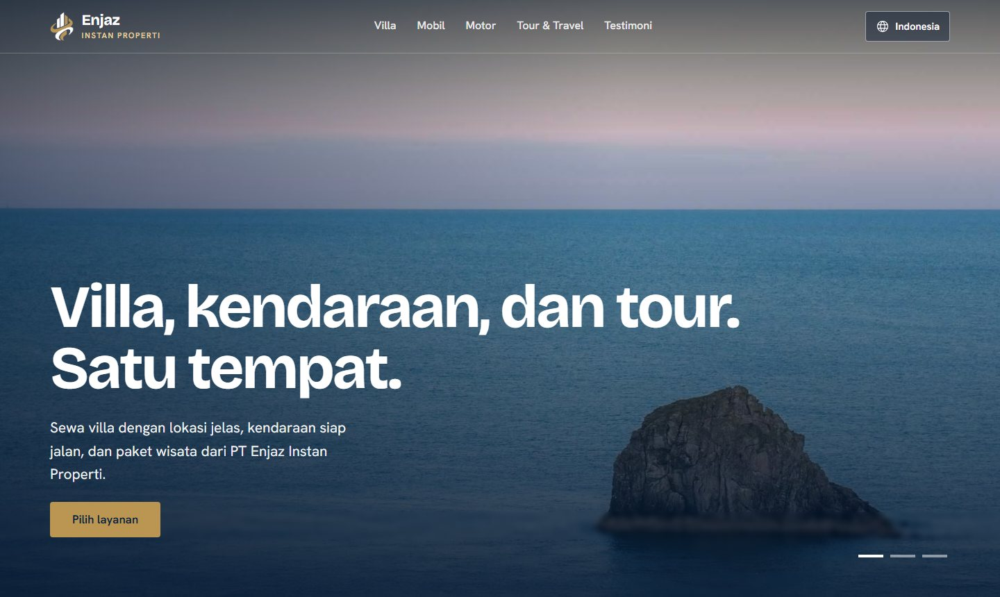
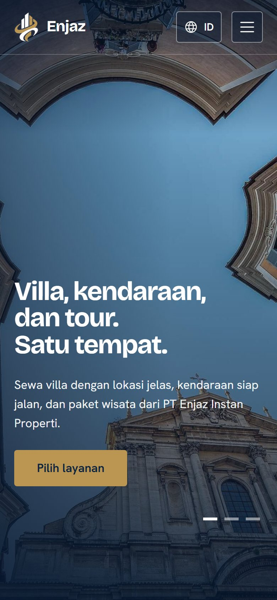
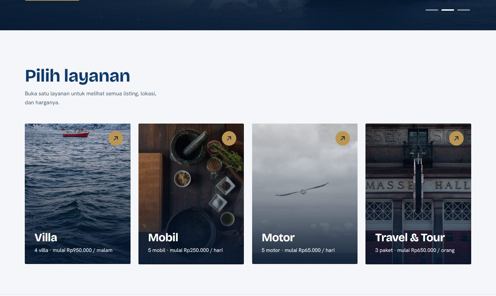
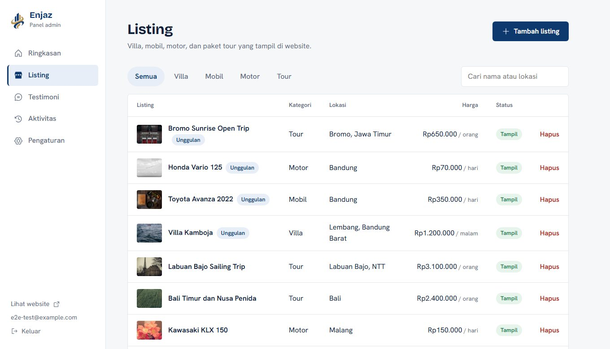

# PT Enjaz Instan Properti: website and admin panel

A production website for an Indonesian company that rents villas, cars and motorbikes and sells tour packages. It is two separate Next.js apps (a public site and an admin panel) that share one MySQL database. The public site speaks **Indonesian, US English and Arabic (right-to-left)**, and every text on it, including prices and pluralisation, is localised.

Built and deployed for a real client. All data in this repository is sample data (invented names, random stock photos).

<!-- Live demo runs on a temporary hosting domain and will move to the client's own domain. -->
**Live demo:** https://seagreen-gazelle-923030.hostingersite.com

| | |
|---|---|
|  |  |
|  |  |

## What it does

**Public site** (`apps/public`)
- Full-screen hero slideshow (crossfade, pauses on hover, honours `prefers-reduced-motion`) with a separate portrait photo set for phones.
- Four service cards (villa, car, motorbike, tour), a category page and a detail page for each listing, an embedded map per villa, an endless testimonials marquee, and the office location in the footer.
- Ordering through WhatsApp with a prefilled message. Several numbers, the first one is the primary contact.
- A category with no listings shows "Coming soon" instead of an empty page, and is kept out of search results until it has content.
- SEO: unique title and description per page, Open Graph and Twitter cards, JSON-LD (`Organization`, `Product`, `TouristTrip`, `BreadcrumbList`), `hreflang`, a per-language sitemap, `robots.txt`.
- Three languages with clean URLs (`/`, `/en`, `/ar`), a full RTL layout for Arabic, and an Arabic web font that is only downloaded on Arabic pages.

**Admin panel** (`apps/admin`)
- Create, edit and delete listings, up to 30 photos each, with a required location for villas.
- Photos are resized and re-encoded in the browser before upload, which also strips EXIF and GPS data. The server checks the real file type and strips metadata again.
- Testimonials with optional round photos, company contact details, hero photos, office address and map link, and English and Arabic translations for the listing and testimonial texts.
- Activity log, downloadable content backup, signed-in devices with "sign out the others", change password and change login email.

## Security

Server-side sessions (only a SHA-256 of the token is stored, the cookie is `__Host-`, `HttpOnly`, `SameSite=Strict`), scrypt password hashing with a password policy, forced password change on first login, login rate limiting stored in the database, an audit log, prepared statements everywhere, magic-byte upload validation, and a nonce-based Content Security Policy (also written as a `<meta>` tag because some hosts replace the header). Every page, server action and route handler checks the session itself, and the proxy is only a first gate.

Honest limits: there is no two-factor authentication yet, and both apps use one database user.

## Tech stack

Next.js 16 (App Router, React 19, Turbopack), TypeScript, MySQL or MariaDB through `mysql2`, plain CSS (logical properties, so RTL comes almost for free), npm workspaces. Photos live in the database (`LONGBLOB`), so the two apps do not need a shared disk. All SQL runs on both MySQL 8 and MariaDB, and the schema is created by append-only migrations when an app starts.

```
apps/public     public website (port 3100)
apps/admin      admin panel (port 3101)
packages/core   database, business rules, validation, auth, CSP: shared by both apps
brand/          logo sources
scripts/        check-public.mjs, the guard that keeps secrets out of this public repo
```

## Run it locally

Requires Node.js 20.9 or newer (22 recommended).

```bash
git clone https://github.com/MuhammadAlwizard/entazproperty.git
cd entazproperty
npm install
cp .env.example .env      # set ADMIN_EMAIL, ADMIN_PASSWORD (12+ chars) and SESSION_SECRET (32+ chars)
npm run dev
```

On Windows, `npm run dev` also starts a portable MariaDB (downloaded once, checksum verified) and both apps. On other systems run your own MySQL or MariaDB and put its address in `DATABASE_URL`. `npm run seed` adds the admin and fake sample content.

Useful commands: `npm run typecheck`, `npm run migrate`, `npm run backup`, `npm run check:public`.

## Deployment

The apps run as two Node.js applications on shared hosting that has no SSH. The `deploy` branch is generated: it holds the prebuilt standalone output of each app, one folder per app, and the host only runs `npm install`. The `main` branch is the source. The procedure is written down, in Indonesian, in [`CLAUDE.md`](CLAUDE.md).

## Status

Working and deployed on a temporary domain. Not done yet: two-factor authentication, automatic cleanup of unused photos, online booking and payment (orders go through WhatsApp), and a native speaker's review of the Arabic text, which was written with AI assistance.

## Documentation and rules

`CLAUDE.md` (Indonesian) is the project's working notes: business rules, security design and deployment.

## License

No license is granted. Company name, logo and brand assets belong to PT Enjaz Instan Properti.
